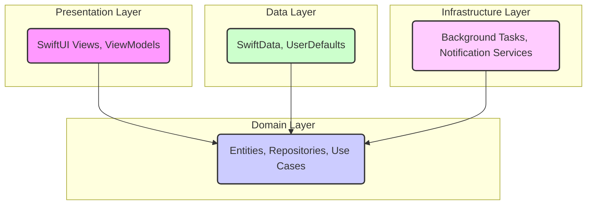

# ReadyKit 

<p align="center">
  <strong>Be prepared for anything. Your privacy-first emergency kit planner.</strong>
</p>

ReadyKit is an open-source iOS application designed to help you prepare for emergencies by creating and managing personalized emergency kits. With a strong focus on privacy, ReadyKit ensures that all your data is stored locally on your device and is never collected or transmitted.

### Features

- **Create and Manage Kits**: Organize your emergency supplies by creating multiple kits for different locations (e.g., home, car, office).
- **Item Management**: Add, edit, duplicate, and track items in each kit. Mark items as packed and see your progress at a glance.
- **Item Duplication**: Quickly duplicate existing items using swipe actions for efficient kit management.
- **Customizable Reminders**: Set reminders to check and update your kits regularly, ensuring your supplies are always ready.
- **Privacy by Design**: All data is stored locally on your device. No external servers, no data collection, no tracking. Your information is yours alone.
- **Open Source**: Built with transparency and community collaboration in mind.

### Privacy First

Your privacy is our top priority. ReadyKit is built on the principle that your data belongs to you.

- **Local Storage**: All information you enter is stored exclusively on your device using SwiftData.
- **No Data Collection**: The app does not collect, store, or transmit any personal data to external servers.
- **Full Transparency**: Our open-source codebase allows anyone to review how the app works and verify our privacy claims.

For more details, please read our [Privacy Policy](PrivacyPolicy.md).

### Architecture

The app follows the Clean Architecture pattern, separating concerns into distinct layers. This makes the codebase modular, testable, and easier to maintain.



### Use Cases (Gherkin Syntax)

The core functionalities of the app are defined by the following use cases:

```gherkin
Feature: Emergency Kit Management

  Scenario: Create a new Emergency Kit
    Given the user is on the main screen
    When the user creates a new emergency kit with a name and description
    Then a new kit should be created and displayed

  Scenario: Fetch All Emergency Kits
    Given the user has created multiple emergency kits
    When the app launches or the user navigates to the kit list
    Then all emergency kits should be fetched and displayed

  Scenario: Update an Emergency Kit's Details
    Given an existing emergency kit
    When the user updates the name or description of the kit
    Then the kit's details should be saved

  Scenario: Delete an Emergency Kit
    Given the user has one or more emergency kits
    When the user deletes a specific kit
    Then the kit should be removed from the user's list of kits

Feature: Item Management

  Scenario: Add Item to Emergency Kit
    Given an existing emergency kit
    When the user adds a new item with details
    Then the item should be saved in the kit

  Scenario: Fetch Items in an Emergency Kit
    Given an emergency kit with items
    When the user views the details of that kit
    Then all items within that kit should be fetched and displayed

  Scenario: Edit an Item in an Emergency Kit
    Given an emergency kit with an existing item
    When the user edits the details of that item
    Then the item's information should be updated in the kit

  Scenario: Delete an Item in an Emergency Kit
    Given an emergency kit contains one or more items
    When the user deletes a specific item from the kit
    Then the item should be removed from the kit

Feature: Preferences and Notifications

  Scenario: Load User Preferences
    Given the user has previously set preferences
    When the app starts
    Then the user's preferences should be loaded

  Scenario: Save User Preferences
    Given the user is in the settings screen
    When the user changes a preference
    Then the new preference should be saved

  Scenario: Check Notification Permission Status
    Given the app needs to schedule notifications
    When the system checks the notification permission status
    Then the app receives the current authorization status

  Scenario: Request Notification Permission
    Given the user has not yet granted notification permissions
    When the user attempts to enable reminders
    Then the app should request permission to send notifications

  Scenario: Reschedule All Reminders
    Given reminder settings have changed
    When the app needs to update its notification schedule
    Then all reminders should be rescheduled

  Scenario: Update App Badge for Expiring and Expired Items
    Given there are items that are expiring or expired
    When a background task runs or the app is opened
    Then the app's icon badge should be updated with the count of those items

Feature: System Integration

  Scenario: Check Background App Refresh Status
    Given the app needs to perform background tasks
    When the system checks the background app refresh status
    Then the app receives the current status
```

### Getting Started

To build and run ReadyKit, you will need:
- A Mac with macOS Sonoma or later.
- Xcode 15 or later.

1. Clone the repository:
   ```sh
   git clone https://github.com/luiswdy/ReadyKit.git
   ```
2. Open the project in Xcode:
   ```sh
   cd ReadyKit
   open ReadyKit.xcodeproj
   ```
3. Build and run the app on the simulator or a physical device.

### Contributing

Contributions are welcome! Whether you want to fix a bug, add a feature, or improve translations, your help is appreciated. Please read our [Code of Conduct](CODE_OF_CONDUCT.md) before contributing.

### License

This project is licensed under the **Creative Commons Attribution-NonCommercial-ShareAlike 4.0 International (CC BY-NC-SA 4.0)** with an additional clause restricting data collection. For more details, see the [LICENSE.md](LICENSE.md) file.
- Localized for multiple languages

## Architecture
ReadyKit uses a modular, clean architecture with clear separation of concerns:

- **App/**: App entry point, configuration, and dependency injection
- **Data/**: Data models, repositories, and mappers for data persistence
- **Domain/**: Core business logic, entities, and use cases
- **Infrastructure/**: System integrations and background tasks
- **Presentation/**: UI views, view models, utilities, and localized errors
- **Resources/**: Assets, localization files, and privacy info

## Folder Structure
```
ReadyKit/
  App/                # App entry, DI, logging
  Data/               # Models, repositories, mappers
  Domain/             # Entities, repositories, use cases
  Infrastructure/     # Background tasks, services
  Presentation/       # Views, view models, utils
  Resources/          # Assets, localization, privacy
  ReadyKit.xcodeproj/ # Xcode project files
  ...
```

## Getting Started

### Requirements
- Xcode 15 or later
- iOS 17.0 or later
- Swift 5.8 or later

### Build & Run
1. Clone this repository:
   ```sh
   git clone https://github.com/luiswdy/ReadyKit
   ```
2. Open `ReadyKit.xcodeproj` in Xcode.
3. Select a simulator or device and press **Run** (⌘R).

## Localization
ReadyKit supports multiple languages. To add or update translations, edit the files in `Resources/Localizable.xcstrings`.

## Testing
- **Unit Tests**: Located in `ReadyKitAlertTests/`
- **UI Tests**: Located in `ReadyKitAlertUITests/`

Run all tests in Xcode using **Product > Test** (⌘U).

## Contributing
Contributions are welcome! Please open issues or submit pull requests for improvements or bug fixes.

## License
See LICENSE.md for license details.

---

**This project is open source software and is provided under its license terms. It comes with no warranties or guarantees, express or implied. Use of this software is at your own risk.**

© 2025 ReadyKit Contributors. All rights reserved.
